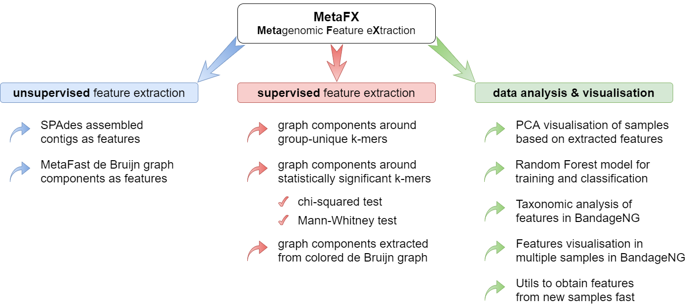
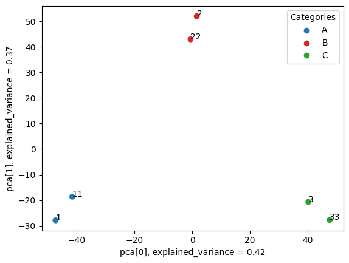

# MetaFX

**MetaFX** (METAgenomic Feature eXtraction) is an open-source library for feature extraction from whole-genome metagenome sequencing data and classification of groups of samples.

The idea behind **MetaFX** is to introduce the feature extraction algorithm specific for metagenomics short reads data. It is capable of processing hundreds of samples 1-10 Gb each. The distinct property of suggest approach is the construction of meaningful features, which can not only be used to train classification model, but also can be further annotated and biologically interpreted.

**MetaFX** documentation is available on the GitHub [wiki page](https://github.com/ivartb/metafx_new/wiki).<br/>
Here is a short version of it.

## Table of contents

  * [Idea of MetaFX](#idea-of-metafx)
  * [Installation](#installation)
  * [Running instructions](#running-instructions) 
  * [Examples](#examples)
  * [Contact](#contact)
  * [License](#license)
  * [See also](#see-also)


## Idea of MetaFX



MetaFX is a toolbox with a lot of modules divided into three groups:

#### Unsupervised feature extraction pipelines

There are pipelines aimed to extract features from metagenomic dataset without any prior knowledge about samples and their relations. Algorithms perform (pseudo-)assembly of samples separately and construct the de Bruijn graph common for all samples. Further, graph components are extracted as features and feature table is constructed.

#### Supervised feature extraction pipelines

There are pipelines aimed to extract group-relevant features based on metadata about samples such as diagnosis, treatment, biochemical results, etc. Dataset is split into groups of samples based on provided metadata information and group-specific features are constructed based on de Bruijn graphs. The resulting features are combined into feature table.

#### Methods for classification and interpretation

There are pipelines for analysis of the feature extraction results. Methods for samples similarity visualisation and training machine learning models are implemented. Classification models can be trained to predict samples' properties based on extracted features and to efficiently process new samples from the same environment.


## Installation

To run MetaFX,  one need to clone repo with all binaries and add them to PATH.

```shell
git clone https://github.com/ivartb/metafx_new
cd metafx_new
export PATH=bin:$PATH
```

##### Requirements:
* JRE 1.8 or higher
* python3
* python libraries listed in `requirements.txt` file. Can be installed using pip <br/>
```shell
python -m pip install --upgrade pip
pip install -r requirements.txt
```
* If you want to use `metafx metaspades` pipeline, you will also need [SPAdes](https://cab.spbu.ru/software/spades/) software. Please follow their [installation instructions](https://github.com/ablab/spades#sec2) (not recommended for first-time use).

Scripts have been tested under *Ubuntu 18.04 LTS* and *Ubuntu 20.04 LTS*, but should generally work on Linux/MacOS.

## Running instructions

To run **_MetaFX_** use the following syntax:

```shell
metafx <pipeline> [<Launch options>] [<Input parameters>]
```

To view the list of supported pipelines run `metafx -h` or `metafx --help`.

To view help for launch options and input parameters for selected _pipeline_ run `metafx <pipeline> -h` or `metafx <pipeline> --help`.

By running MetaFX a working directory is created (by default `./workDir/`).
All intermediate files and final results are saved there.

## Examples

Examples and documentation for all MetaFX modules can be found in the [Wiki](https://github.com/ivartb/metafx_new/wiki). 

Here is presented a minimal example of data analysis with MetaFX algorithms:

#### Step 1. Extract features from samples of three categories

```shell
metafx unique -t 2 -m 1G -w wd_unique -k 31 -i test_data/sample_list_train.tx
```

##### Input parameters

|parameter              |description                                                                         |
|:----------------------|:-----------------------------------------------------------------------------------|
|**-t** &lt;int&gt;     |number of threads to use                                                            | 
|**-m** &lt;MEM&gt;     |memory to use (values with suffix: 1500M, 4G, etc.)                                 |
|**-w** &lt;dirname&gt; |working directory                                                                   |
|**-k** &lt;int&gt;     |k-mer size (in nucleotides)                                                         |
|**-i** &lt;filename&gt;|tab-separated file with 2 values in each row: &lt;path_to_file&gt;\t&lt;category&gt;|


##### Output files

|file                            |description                                                                                         |
|:-------------------------------|:---------------------------------------------------------------------------------------------------|
|wd_unique/categories_samples.tsv|tab-separated file with 3 columns: &lt;category&gt;\t&lt;present_samples&gt;\t&lt;absent_samples&gt;|
|wd_unique/samples_categories.tsv|tab-separated file with 2 columns: &lt;sample_name&gt;\t&lt;category&gt;                            |
|wd_unique/feature_table.tsv     |tab-separated numeric features file: rows – features, columns – samples                             |
|wd_unique/contigs_&lt;category&gt;/seq-builder-many/sequences/component.seq.fasta|contigs in FASTA format as features for each category (suitable for annotation and biological interpretation)|

#### Step 2. Visualise samples proximity

```shell
metafx pca -w wd_pca -f wd_unique/feature_table.tsv -i wd_unique/samples_categories.tsv --show
```

##### Input parameters

|parameter|description|
|:----------------------|:-----------------------------------------------------------------------------|
|**-w** &lt;dirname&gt; |working directory                                                             |
|**-f** &lt;filename&gt;|file with feature table in tsv format: rows – features, columns – samples     |                                                        |
|**-i** &lt;filename&gt;|tab-separated file with 2 values in each row: &lt;sample&gt;\t&lt;category&gt;|
|**--show**             |print samples' names on plot                                                  |

##### Output files

`wd_pca/pca[.png|.svg]` – PCA visualisation of samples based on extracted features. As a result you should obtain the similar image showing the clear separation of samples into three clusters.



#### Step 3. Train classification model for category prediction

```shell
metafx cv -t 2 -w wd_cv -f wd_unique/feature_table.tsv -i wd_unique/samples_categories.tsv -n 2 --grid
```

##### Input parameters

|parameter|description|
|:----------------------|:-----------------------------------------------------------------------------|
|**-t** &lt;int&gt;     |number of threads to use                                                      | 
|**-w** &lt;dirname&gt; |working directory                                                             |
|**-f** &lt;filename&gt;|file with feature table in tsv format: rows – features, columns – samples     |                                                        |
|**-i** &lt;filename&gt;|tab-separated file with 2 values in each row: &lt;sample&gt;\t&lt;category&gt;|
|**-n** &lt;int&gt;     |number of folds in cross-validation                                           | 
|**--grid**             |perform grid search of optimal parameters for classification model            |

##### Output files

`wd_cv/rf_model_cv.joblib` – trained Random Forest model to predict samples' categories based on extracted features.

#### Step 4. Process new samples with _hidden_ categories

```shell
metafx calc_features -t 2 -m 1G -w wd_new_samples -k 31 -d wd_unique/ \
        -i test_data/test_A_R1.fastq.gz test_data/test_A_R2.fastq.gz \
           test_data/test_B_R1.fastq.gz test_data/test_B_R2.fastq.gz \
           test_data/test_C_R1.fastq.gz test_data/test_C_R2.fastq.gz
```

##### Input parameters

|parameter|description|
|:----------------------|:-----------------------------------------------------------------------------|
|**-t** &lt;int&gt;     |number of threads to use                                                      | 
|**-m** &lt;MEM&gt;     |memory to use (values with suffix: 1500M, 4G, etc.)                           |
|**-w** &lt;dirname&gt; |working directory                                                             |
|**-k** &lt;int&gt;     |k-mer size (in nucleotides)                                                   |
|**-d** &lt;dirname&gt; |directory with results from MetaFX feature extraction module, containing folders with components.bin file for each category|
|**-i** &lt;filenames&gt;|list of reads files from single environment (FASTQ, FASTA, gzip- or bzip2-compressed)|

##### Output files

`wd_new_samples/feature_table.tsv` – tab-separated numeric features file for new samples: rows – features, columns – samples.

#### Step 5. Get prediction results for new samples

```shell
metafx predict -w wd_predict -f wd_new_samples/feature_table.tsv --model wd_cv/rf_model_cv.joblib
```

##### Input parameters

|parameter|description|
|:----------------------|:-----------------------------------------------------------------------------|
|**-w** &lt;dirname&gt; |working directory                                                             |
|**-f** &lt;filename&gt;|file with feature table in tsv format: rows – features, columns – samples     |                                                        |
|**--model** &lt;filename&gt;|file with pre-trained classification model, obtained via `fit` or `cv` module|                                                        |

##### Output files

`wd_predict/predictions.tsv` – tab-separated file with samples' names and predicted categories. As we can see by the results, categories for all samples were correctly predicted.

|sample|predicted category|true category|
|:----:|:----------------:|:-----------:|
|test_A|A|A|
|test_B|B|B|
|test_C|C|C|

## Contact

Please report any problems directly to the GitHub [issue tracker](https://github.com/ivartb/metafx_new/issues).

Also, you can send your feedback to [abivanov@itmo.ru](mailto:abivanov@itmo.ru).

Authors:
* **Software:** *Artem Ivanov* ([ITMO University](https://en.itmo.ru/)) and *Vladimir Popov* ([SPbSU](https://english.spbu.ru/))
* **Testing:** *Artem Ivanov* ([ITMO University](http://en.itmo.ru/en/))
* **Idea, supervisor:** [*Vladimir Ulyantsev*](https://ulyantsev.com) ([ITMO University](http://en.itmo.ru/en/))

## License

The MIT License (MIT)

## See also

* [MetaFast](https://github.com/ctlab/metafast/) – a toolkit for comparison of metagenomic samples.
* [MetaCherchant](https://github.com/ctlab/metacherchant) – a tool for analysing genomic environment within a metagenome.
* [RECAST](https://github.com/ctlab/recast) – a tool for sorting reads per their origin in metagenomic time series.